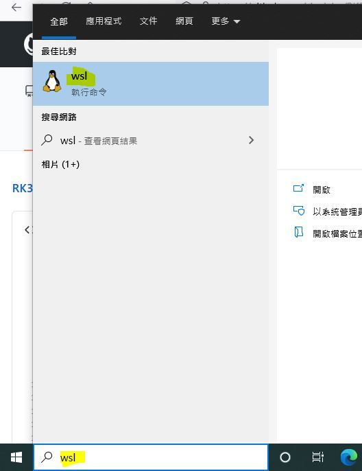
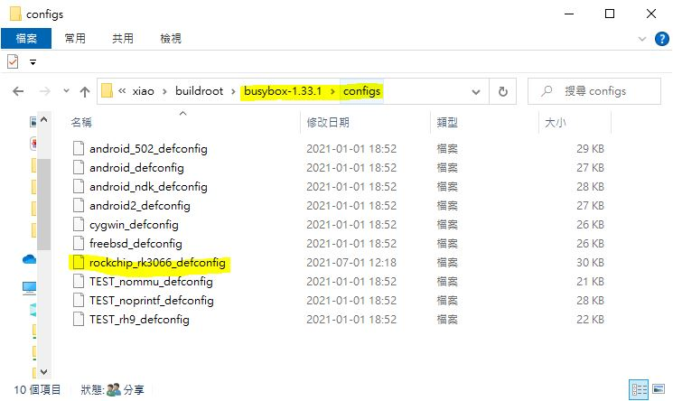
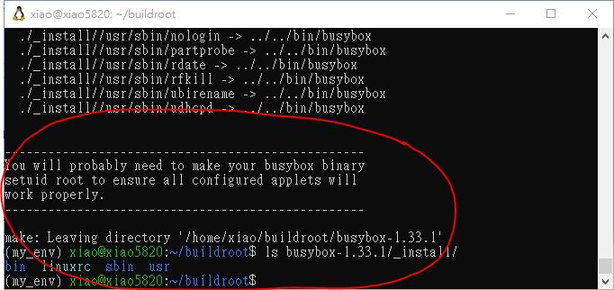

# RK3066-firmware-build
uses WIN10 WSL, rockchip rk3066 firmware build, busybox 1.24.1 failed, 1.33.1 ok, ref: https://lexra.pixnet.net/blog/post/350619827  


win10 command line, invoke wsl terminal,  
wsl  
  


Step 1 — Setting Up Python 3

ref: https://www.digitalocean.com/community/tutorials/how-to-install-python-3-and-set-up-a-programming-environment-on-an-ubuntu-20-04-server

Ubuntu 20.04 and other versions of Debian Linux ship with Python 3 pre-installed. 
To make sure that our versions are up-to-date, let’s update and upgrade the system with the apt command to work with 
Ubuntu’s Advanced Packaging Tool:
```
sudo apt update
sudo apt -y upgrade
```  

The -y flag will confirm that we are agreeing for all items to be installed, but depending on your version of Linux, 
you may need to confirm additional prompts as your system updates and upgrades. 


Once the process is complete, we can check the version of Python 3 that is installed in the system by typing: 
```
python3 -V
```

To manage software packages for Python, let’s install pip, 
a tool that will install and manage programming packages we may want to use in our development projects. 
You can learn more about modules or packages that you can install with pip by reading “How To Import Modules in Python 3.”
```
sudo apt install -y python3-pip
```

Python packages can be installed by typing:
"pip3 install package_name"


```
sudo apt install -y build-essential libssl-dev libffi-dev python3-dev
```

Step 2 — Setting Up a Virtual Environment

```
sudo apt install -y python3-venv
mkdir environments
cd environments
python3 -m venv my_env
ls my_env
source my_env/bin/activate
```


You still need to install repo. 
repo is a third party tool built on top of git. See: http://source.android.com/source/downloading.html for how to install

```
mkdir ~/bin
PATH=~/bin:$PATH
curl https://storage.googleapis.com/git-repo-downloads/repo > ~/bin/repo
chmod a+x ~/bin/repo
```
Already have google repo Installed, still wondering what went wrong ?
Add PATH=~/bin:$PATH to the end of file ~/.bashrc and then run source ~/.bashrc

read Rockhip http://rockchip.wikidot.com/linux-user-guide#toc3
install Rockchip Linux build tool & enviroment,

clone RK source code,
```
mkdir rk-linux
cd rk-linux
repo init -u https://github.com/rockchip-linux/manifests
repo sync
```


Build environment, Please use GCC 5
```
sudo apt-get install git-core gitk git-gui gcc-arm-linux-gnueabihf u-boot-tools device-tree-compiler gcc-aarch64-linux-gnu mtools parted pv
```

Building kernel
Installing the build tools and download source
Please follow linux user guide to install the build tools and download source.
Compile the kernel:
For ARM v7 (i.e. RK3066)
```
make ARCH=arm CROSS_COMPILE=arm-linux-gnueabihf- rockchip_linux_defconfig
make ARCH=arm CROSS_COMPILE=arm-linux-gnueabihf- -j4
```

Building uboot
Installing the build tools and download source

Please follow linux user guide to install the build tools and download source.

Compile the Uboot

You should choose your board defconfig from here. ie. we are using evb-rk3288.

CROSS_COMPILE=arm-linux-gnueabihf- make evb-rk3288_defconfig all


## build busybox, test for rk3066
ref: https://lexra.pixnet.net/blog/post/350619827  
result : NG, kernel source error somthing, did not rememberm

try the latest version of busybox, it is 1.33.1 (2021-07-01)

### intall gcc-arm first, otherwise build will fails  
```
sudo apt-get install gcc-arm*
```

### get the source code of busybox  
```
wget https://busybox.net/downloads/busybox-1.33.1.tar.bz2
```

### decompress souece code  
```
tar jxvf busybox-1.33.1.tar.bz2
```
### copy and save the rockchip_rk3066_defconfig, a must before doing next  
\busybox-1.33.1\configs\rockchip_rk3066_defconfig

download here [rockchip_rk3066_defconfig](rockchip_rk3066_defconfig), the exactly file copied from ref.   

this filename is working same with buildroot of rk3066, something like this,  
  


### i did not know what is exactly doing, but this command is working  

```
make ARCH=arm V=1 CROSS_COMPILE=arm-linux-gnueabihf- -C busybox-1.33.1 rockchip_rk3066_defconfig
```

### should be clean up somthing and build again,  these commands are working  
```
sudo make ARCH=arm V=1 CROSS_COMPILE=arm-linux-gnueabihf- -C busybox-1.33.1 clean
make ARCH=arm V=1 CROSS_COMPILE=arm-linux-gnueabihf- -C busybox-1.33.1
sudo make ARCH=arm V=1 CROSS_COMPILE=arm-linux-gnueabihf- -C busybox-1.33.1 install
```

### build busybox is done
```
ls busybox-1.33.1/_install/
```

soemthing like this,
  

